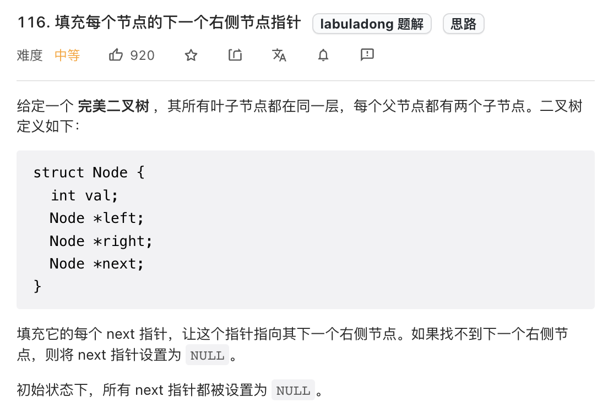
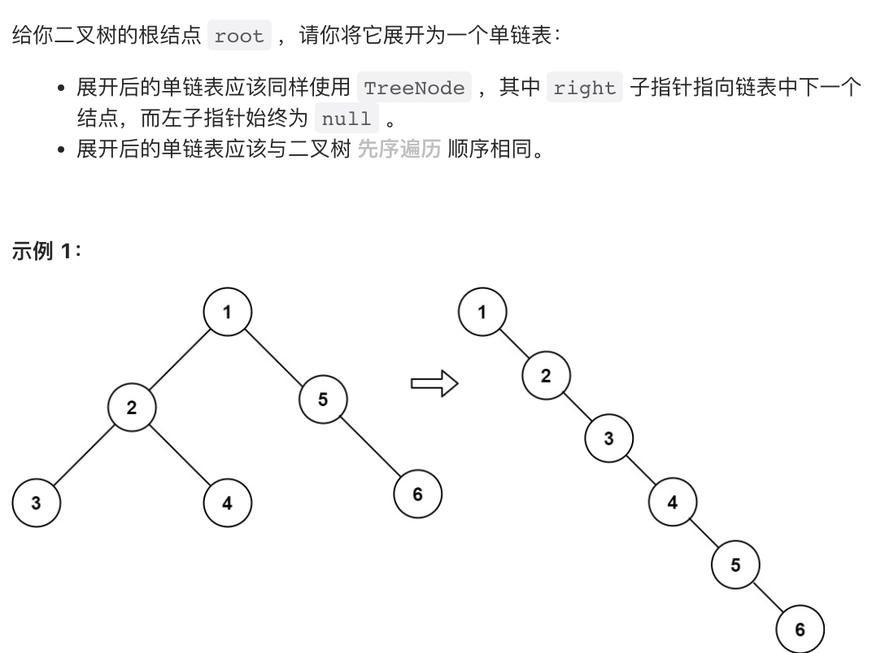
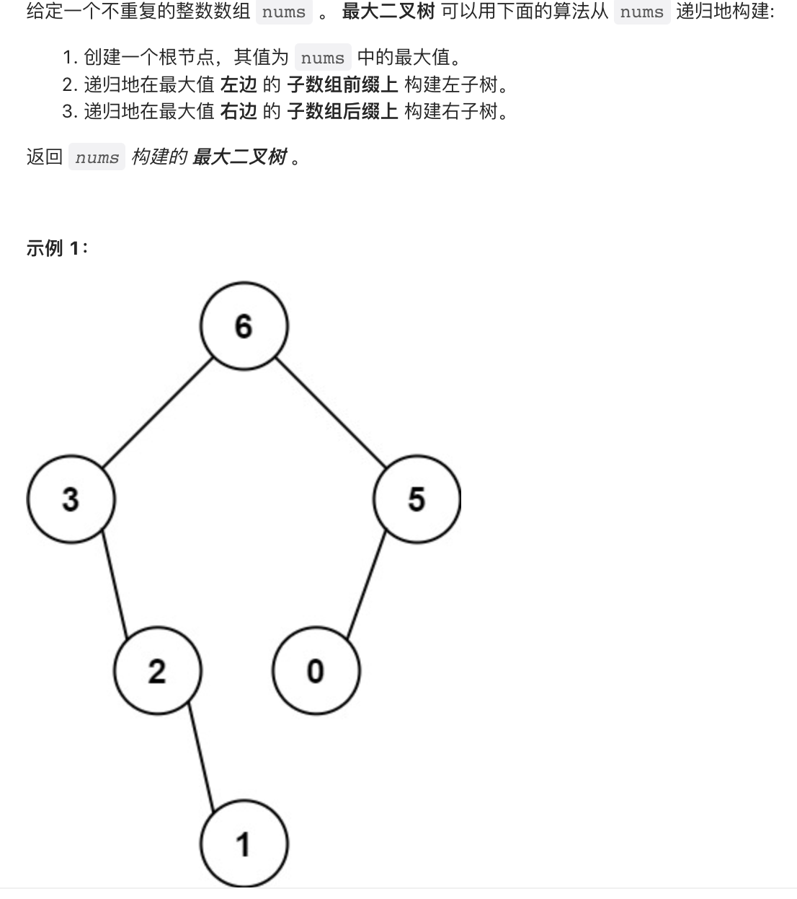

## 二叉树解题思维
二叉树的解题思维分为两步：
1. **二叉树的遍历思维**：可以根据遍历一次二叉树，使用`traverse`函数配合外部变量来实现
2. **二叉树的分解思维**：定义一个递归函数，通过子问题（子树）的答案推导出原问题的答案，然后写出这个函数的定义，并利用这个函数的返回值。
## 二叉树的前中后序遍历
二叉树的遍历框架：
```go
func traverse(root *TreeNode) {
	if root == nil {
		return
	}
	//前序位置
	traverse(root.Left)
	//中序位置
	traverse(root.Right)
	//后序位置
}
```
**前中后序是遍历二叉树过程中处理每一个节点的三个特殊时间点**
> 前序位置的代码在刚刚进入一个二叉树节点时执行
> 后序位置的代码在将要离开一个二叉树节点时执行
> 中序位置的代码是在一个二叉树节点左子树遍历完了，即将开始遍历右子树时执行
## 解题思路
拿一道题来理解遍历思维和分解思维[Leetcode104: 二叉树的最大深度](https://leetcode.cn/problems/maximum-depth-of-binary-tree/)所谓最大深度就是根节点到「最远」叶子节点的最长路径上的节点数
遍历思维：遍历一遍二叉树，用一个外部变量来记录当前节点的深度，取最大值就可以找到二叉树的最大深度
```go
var res int 
var depth int //当前节点所在深度

func traverse(root *TreeNode) {
	if root == nil {
		return
	}
	depth++ //前序位置
	if root.Left == nil && root.Right == nil { //到达叶子节点
		if depth > res {
			res = depth
		}
	}
	traverse(root.Left)
	traverse(root.Right)
	//后序位置
	depth--
}

func maxDepth(root *TreeNode) int{
	res = 0
	depth = 0
	traverse(root)
	return res
}
```
分解思维：一棵二叉树的最大深度可以根据子树的最大深度推导出来
```go
func maxDepth(root *TreeNode) int {
	if root == nil {
		return 0
	}
	//利用函数定义，计算左右子树的最大深度
	leftMax := maxDepth(root.Left)
	rightMax := maxDepth(root.Right)
	//整棵树的最大深度=max(左子树最大深度，右子树最大深度) + 根节点自己
	if leftMax > rightMax {
		return leftMax + 1
	} else {
		return rightMax + 1
	}
}
```
## 二叉树的层序遍历
```go
func levelTraverse(root *TreeNode) [][]int {
	res := [][]int{}
	if root == nil {
		return res
	}
	path := []int{} //记录一层的节点
	queue := list.New()
	queue.PushBack(root)
	for queue.Len() > 0 {
		len := queue.Len()
		for i := 0; i < len; i++ {
			node := queue.Remove(queue.Front()).(*TreeNode)
			path = append(path, node.Val)
			if node.Left != nil {
				queue.PushBack(node.Left)
			} 
			if node.Right != nil {
				queue.PushBack(node.Right)
			}
		}
		res = append(res, path)
		path = []int{}
	}
	return res
}
```

## 二叉树练习题
[Leetcode226: 翻转二叉树](https://leetcode.cn/problems/invert-binary-tree/)
1. 遍历思维：写一个`traverse`函数，每遍历一个节点，就把他的左右子节点颠倒过来就可以了
>思考：每个节点需要做什么？ 在什么时候做？
>每个节点需要做的就是将自己的左右节点颠倒，在前中后序做都可以
```go
func invertTree(root *TreeNode) *TreeNode{
	traverse(root)
	return root
}

func traverse(root *TreeNode) {
	if root == nil {
		return
	}
	//前序位置
	//颠倒左右子节点
	root.Left, root.Right = root.Right, root.Left

	traverse(root.Left)
	traverse(root.Right)
}
```
2. 分解思维：我们来看一下`invertTree`的定义，将以`root`为根的二叉树翻转，返回翻转后的跟节点，所以我们可以利用这个函数定义和返回值，用分解的思想，构造子树问题，将左子树颠倒，再将右子树颠倒，最后颠倒root的左右子树
```go
func invertTree(root *TreeNode) *TreeNode{
	if root == nil {
		return nil
	}
	//利用函数定义先翻转左右子树
	left := invertTree(root.Left)
	right := invertTree(root.Right)

	//然后交换左右子节点
	root.Left = right
	root.Right = left
	return root
}
```

[Leetcode116: 填充每个节点的下一个右侧节点指针](https://leetcode.cn/problems/populating-next-right-pointers-in-each-node/)

1. 遍历思维：当我们使用传统的`traverse`函数来遍历二叉树时会发现我们没办法将不属于同意个父节点的两个节点连接起来，传统的`traverse`函数其实遍历的是二叉树的节点，但现在我们想遍历的是两个相邻节点之间的空隙。所以我们重新写一个`traverse`函数
```go
func connect(root *Node) *Node {
	if root == nil {
		return
	}
	traverse(root.Left, root.Right)
	return root
}
func traverse(node1 *Node, node2 *Node) {
	if node1 == nil || node2 == nil {
		return
	}
	//将传入的两个节点连接起来
	node1.Next = node2
	//连接相同父节点的两个字节点
	traverse(node1.Left, node1.Right)
	traverse(node2.Left, node2.Right)
	//连接不属于同一个父节点的两个相邻节点
	traverse(node1.Right, node2.Left)
}
```
2. 分解思维：这道题无法使用分解思维解

[Leetcode114. 二叉树展开为链表](https://leetcode.cn/problems/flatten-binary-tree-to-linked-list/)

1. 遍历思维：这里注意，`flatten`函数的返回值是`void`，也就是说题目希望我们原地将二叉树转换为链表，所以没办法通过遍历的方式去解决
2. 分解思维：我们来看一下`flatten`函数的定义，输入一个二叉树的节点`root`，把以`root`为根的二叉树转换为链表，所以具体思路可以理解为，对于一个节点`x`，先利用`flatten(x.Left)`和`flatten(x.Right)`将左右子树拉平，再将左子树替换到右子树的位置，再将右子树重新挂在新的右子树下面。
```go
func flatten(root *TreeNode) {
	if root == nil {
		return 
	}
	//利用函数定义将左右子树拉平
	flatten(root.Left)
	flatten(root.Right)
	//用左子树替换当前的右子树
	left := root.Left
	right := root.Right
	root.Left = nil
	root.Right = left
	//将右子树挂在新的右子树后面
	p := root
	for p.Right != nil {
		p = p.Right
	}
	p.Right = right
}
```

## 构造二叉树
**二叉树的构造问题一般都是使用「分解问题」的思路：构造整棵树 = 根节点 + 构造左子树 + 构造右子树**。
[Leetcode 654. 最大二叉树](https://leetcode.cn/problems/maximum-binary-tree/)

思路：
	1. 遍历数组找到最大值，从而把根节点做出来
	2. 对最大值左边的数组和右边的数组递归的构建二叉树，作为root的左右子树
```go
func constructMaximumBinaryTree(nums []int) *TreeNode {
	if root == nil {
		return nil
	}
	maxVal := 0
	maxIndex := 0
	//寻找最大值，构造root
	for i, v := range nums {
		if v > maxVal {
			maxVal = v
			maxIndex = i
		}
	}
	root := &TreeNode{}
	root.Val = maxVal
	//递归构造左右子树
	root.Left = constructMaximumBinaryTree[:maxIndex]
	root.Right = constructMaximumBinaryTree[maxIndex + 1:]
	return root
}
```

[Leetcode105. 从前序与中序遍历序列构造二叉树](https://leetcode.cn/problems/construct-binary-tree-from-preorder-and-inorder-traversal/)
[Leetcode106. 从中序与后序遍历序列构造二叉树](https://leetcode.cn/problems/construct-binary-tree-from-inorder-and-postorder-traversal/)
